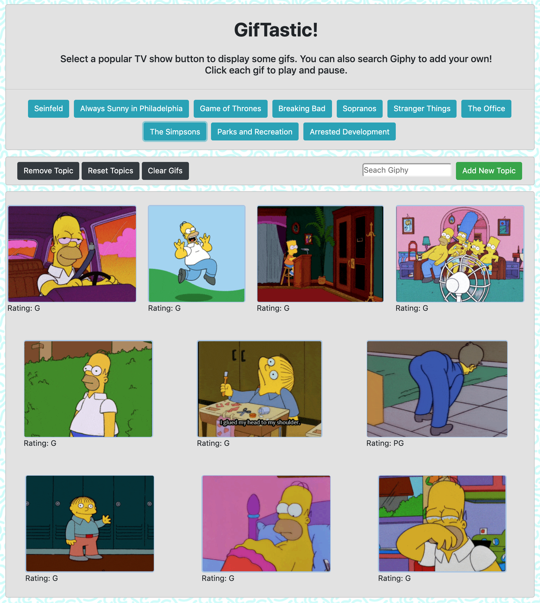

# GifTastic

### [Link to App](https://matthewemichael.github.io/GifTastic/index.html)

### Overview

In this assignment, we used the GIPHY API to make a dynamic web page that populates with gifs of my choice. To finish this task, the app calls the GIPHY API and use JavaScript and jQuery to change the HTML of your site.

### Requirements

* App must suit these basic specs:
  * Create an array of strings, each one related to a topic that interests you. Save it to a variable called `topics`.
  * Your app should take the topics in this array and create buttons in your HTML.
  * When the user clicks on a button, the page should grab 10 static, non-animated gif images from the GIPHY API and place them on the page.
  * When the user clicks one of the still GIPHY images, the gif should animate. If the user clicks the gif again, it should stop playing.
  * Under every gif, display its rating (PG, G, so on).
  * Add a form to your page that takes a value from a user input box and adds it to your `topics` array. Then make a function call that takes each topic in the array and remakes the buttons on the page.

### Additional Features

* App is fully mobile responsive.
* Users can request additional gifs to be added to the page.
  * Each request adds 10 gifs to the page and does not overwrite the existing gifs. 
* Users can remove topics and reset topics to the initial selection.
* Users can click a button to remove the gifs from the page.

### Technologies Used
- [Bootstrap](https://getbootstrap.com/docs/4.0/getting-started/introduction/)
- [jQuery](https://www.jguery.com/)
- [AJAX](https://developer.mozilla.org/en-US/docs/Web/Guide/AJAX)
- [GIPHY API](https://developers.giphy.com/)
### Screen Shot
